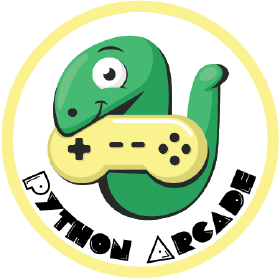

<!DOCTYPE html>
<html>
<head> 
	<link rel="stylesheet" href="styling.css"/>
</head>

<h2>Hey, I'm Daniel   </h2>

<h1> Check out some of my favorite projects! </h1>

<body>
<div class="parent">
	<div class="child">
		<a href="https://www.linkedin.com/in/danielwang04/">
			
		</a>
	</div>
	<div class="child">
		<a href="mailto:daniel.wang@focusyouth.ca">
			
		</a>
	</div>
</div>
</body>
</html>


<h2>Favorite Programming Languages</h2>


 


<br></br> 

<h2>Favorite IDEs</h2>


<br></br> 

<h2>Favorite APIs/SDKs</h2>





 <br></br> 

 <h2>More About Me!</h2>

 ```java
 package io.github.daniel-wang-design;

 public class Daniel {
	public Daniel() {
		List<Hobby> hobbies = new ArrayList<>();
		hobbies.add(new Hobby("Guitar", new start(2016)))
		hobbies.add(new Hobby("Sports/excercise", new start(2012)))
		hobbies.add(new Hobby("Charity work, FOCUS Youth Organization", 
		                       new start(2018)))


	}

	private University getEducation() {
		return new University(
			"University of Waterloo", 
			"Honours Computer Science Co-op", 
			new GradYear(2027)
		);
	}
	private String getCountry() {
		return "Canada";
	}
}
	
 ```
 
<h2>Current Works</h2>

 * Started learning Google Admin API
 * Currently working on building websites (and learning more HTML, CSS, and JS)
 * Looking for summer co-op (2023)
 
<h2>Other Stuff</h2>

[My Resume (coming soon!)](https://drive.google.com/file/d/1uxq1shtoVfoD8D4sD5MHN3drGVA50vlz/view?usp=sharing) | [My Website (coming soon!)](daniel-wang-design.github.io) | [Support my cause!](https://www.canadahelps.org/en/charities/focus-youth-organization/)


 
 